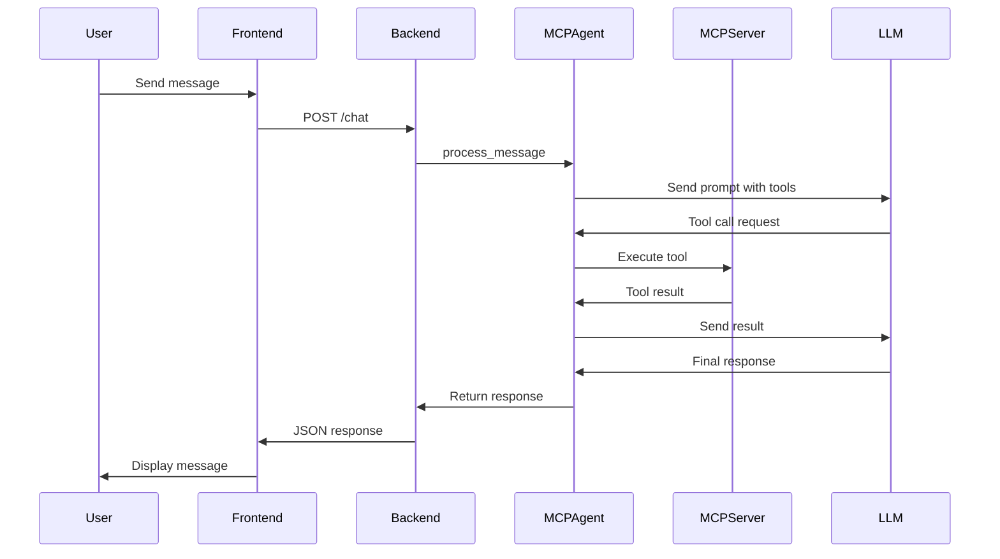

# MCP Client

A Python-based MCP (Model Context Protocol) client application that enables conversational AI interactions with integrated tools via MCP servers. Built with FastAPI backend, LangChain for agent orchestration, and Azure OpenAI for LLM capabilities. Includes a static web frontend for chat and a terminal client for testing.

## About the Repository

This repository implements an MCP client that connects to multiple MCP servers (local stdio or remote HTTP) to provide tool-augmented AI responses. The system uses LangChain's MCP adapters to bind server tools to an Azure OpenAI LLM, enabling seamless tool-calling in conversations. Key features include:

- Modular architecture separating HTTP handling, agent logic, and configuration
- Support for multiple MCP servers with dynamic tool discovery
- REST API for chat interactions
- Admin interface for runtime server configuration updates
- Example math MCP server included for demonstration

## About MCP (Model Context Protocol)

MCP is a protocol for connecting AI models to external tools and data sources. It allows LLMs to call functions from MCP servers, which can perform computations, access databases, or interact with APIs. This project demonstrates MCP integration by:

- Running MCP servers as separate processes
- Fetching available tools at startup
- Binding tools to the LLM for automatic invocation during conversations
- Parsing and injecting tool results back into the conversation flow

## Code Structure

```
MCP-Client/
├── app.py                 # FastAPI application with HTTP routes and admin endpoints
├── mcp_engine.py          # Core MCP agent logic (MCPAgent class)
├── servers.py             # Configuration for MCP servers
├── config.py              # Environment variable loading and constants
├── MathMCPserver.py       # Example MCP server (math tools)
├── pyproject.toml         # Python dependencies and metadata
├── .env                   # Environment variables (not committed)
├── frontend/              # Static web assets
│   ├── index.html         # Chat UI
│   ├── config.js          # Frontend configuration
│   └── vercel.json        # Vercel deployment config
├── terminal MCP client/   # Standalone testing scripts
│   ├── MCPclient1.py      # Terminal-based MCP client
│   └── temp.py            # Temporary scripts
└── .github/
    ├── workflows/         # GitHub Actions
    └── copilot-instructions.md  # AI assistant guidelines
```

## Code Flow

The following Mermaid diagram illustrates the flow of a chat request through the system:



## Setup Steps

### Prerequisites
- Python 3.12 or higher
- `uv` package manager (install via `pip install uv` or from [uv documentation](https://github.com/astral-sh/uv))

### 1. Clone the Repository
```bash
git clone <repository-url>
cd MCP-Client
```

### 2. Install Dependencies
```bash
uv sync
```

### 3. Configure Environment Variables
Create a `.env` file in the root directory with the following variables:
```
AZURE_OPENAI_ENDPOINT=https://your-endpoint.openai.azure.com/
AZURE_OPENAI_API_KEY=your-api-key
AZURE_DEPLOYMENT=gpt-4o-mini
AZURE_API_VERSION=2025-01-01-preview
ADMIN_TOKEN=your-secure-admin-token
```

**Note:** Ensure the `.env` file is not committed to version control. The application will fail to start without valid Azure OpenAI credentials.

### 4. Run the Backend
```bash
uvicorn app:app --host 0.0.0.0 --port 8000
```

The API will be available at `http://localhost:8000`.

### 5. (Optional) Run the Math MCP Server
For testing tool-calling with the included math server:
```bash
uv run fastmcp run MathMCPserver.py
```

### 6. Set Up the Frontend
- For local development: Serve the `frontend/` directory with any static server (e.g., `python -m http.server 3000` in the `frontend/` folder).
- Update `frontend/config.js` to point to your backend URL (default is production URL).
- For production: Deploy to Vercel or similar using `vercel.json`.

### 7. Test with Terminal Client
Run the standalone client for testing:
```bash
python "terminal MCP client/MCPclient1.py"
```

## Usage

### Chat API
Send POST requests to `/chat` with JSON body:
```json
{
  "message": "Roll 5 dice and calculate the sum"
}
```

The response includes the AI's message and any tool call results.

### Admin Interface
Access the web UI at the frontend URL. Use the admin modal (requires `ADMIN_TOKEN`) to update server configurations in `servers.py` and restart the backend.

### Adding New MCP Servers
1. Define the server in `servers.py` (use relative paths for portability).
2. Restart the backend to reload tools.
3. Test via the chat interface or terminal client.

## Development Notes

- **Path Compatibility:** Current absolute paths in `servers.py` are Windows-specific. Update to relative paths for cross-platform use.
- **No Automated Tests:** Test manually via API or terminal client.
- **Security:** Use strong `ADMIN_TOKEN` and restrict CORS in production.
- **MCP Servers:** Ensure servers are running and accessible; tool calls will fail silently if unavailable.

## Contributing

1. Follow the code style guidelines in `.github/copilot-instructions.md`.
2. Test changes with the terminal client.
3. Update this README for any architectural changes.

## License

[Add license information here]